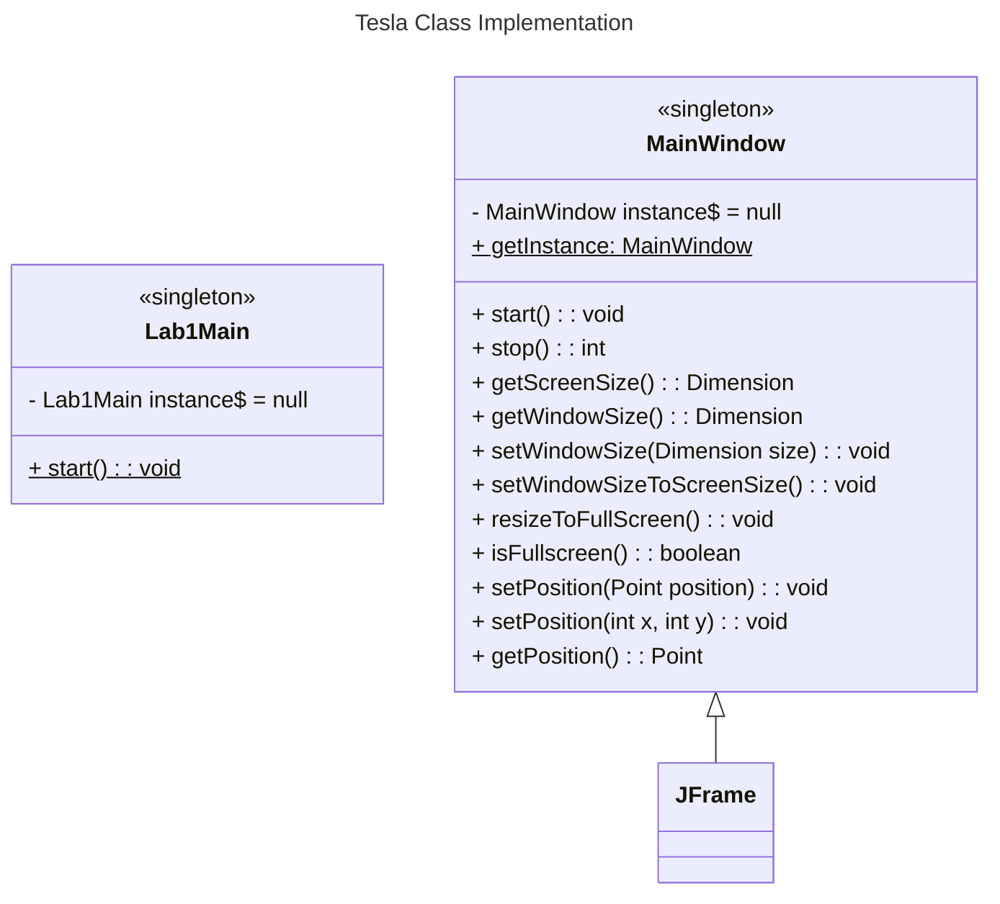

# lab1 documentation

This is the documentation for lab1.

## UML

The UML diagram was made using mermaid.

[//]: # (What follows is the mermaid code for the UML diagram

```mermaid
---
title: Tesla Class Implementation
---
classDiagram
    class Lab1Main {
        <<singleton>>
        - Lab1Main instance$ = null

        + start(): void$
    }
    
    class MainWindow {
        <<singleton>>
        - MainWindow instance$ = null

        + getInstance: MainWindow$
        + start(): void
        + stop(): int
        + getScreenSize(): Dimension
        + getWindowSize(): Dimension
        + setWindowSize(Dimension size): void
        + setWindowSizeToScreenSize(): void
        + resizeToFullScreen(): void
        + isFullscreen(): boolean
        + setPosition(Point position): void
        + setPosition(int x, int y): void
        + getPosition(): Point
    }
    
    MainWindow <|-- JFrame
```