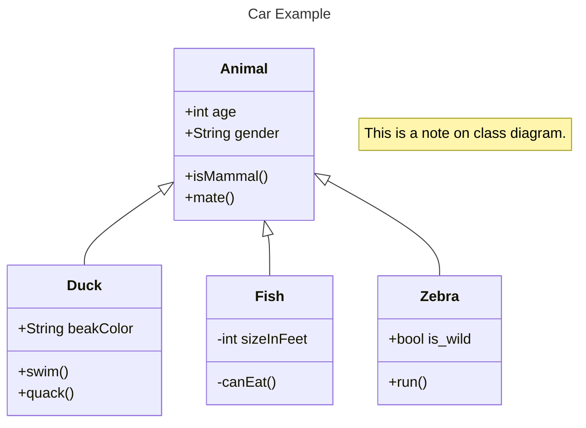

# Class diagram

This is the UML diagram for a Car.

```Java
public class Car {
    
}
```


```mermaid
---
title: Car Example
---
classDiagram
    note "This is a note on class diagram."
    Animal <|-- Duck
    Animal <|-- Fish
    Animal <|-- Zebra
    Animal : +int age
    Animal : +String gender
    Animal: +isMammal()
    Animal: +mate()
    class Duck{
        +String beakColor
        +swim()
        +quack()
    }
    class Fish{
        -int sizeInFeet
        -canEat()
    }
    class Zebra{
        +bool is_wild
        +run()
    }
```
